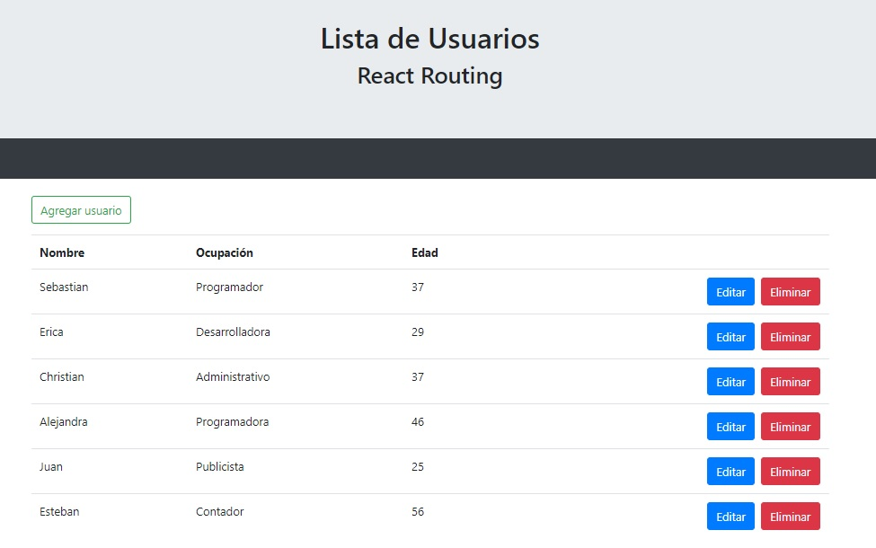

# Usuarios-crud-react
Lista de usuarios con las funciones de crear nuevo usuario, editar y eliminar :pushpin: :white_check_mark:

Tecnología usada: React :hammer:

_Preview_ :eyes::



gh-pages : https://meliyanguas.github.io/Usuarios-crud-react/

### Iniciar 🔧
_Inicializar la aplicación_

```
npm start
```
_Iniciar el servidor dentro de la carpeta server_

_>cd server_
```
json-server --watch db.json --port 3001
```
